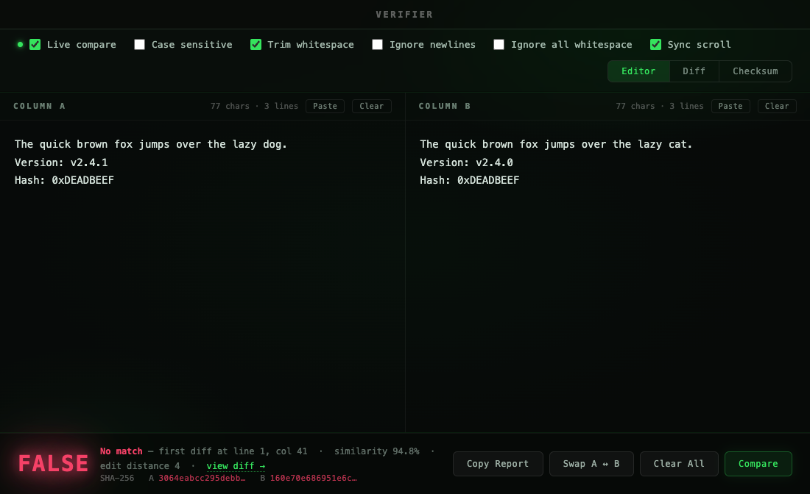
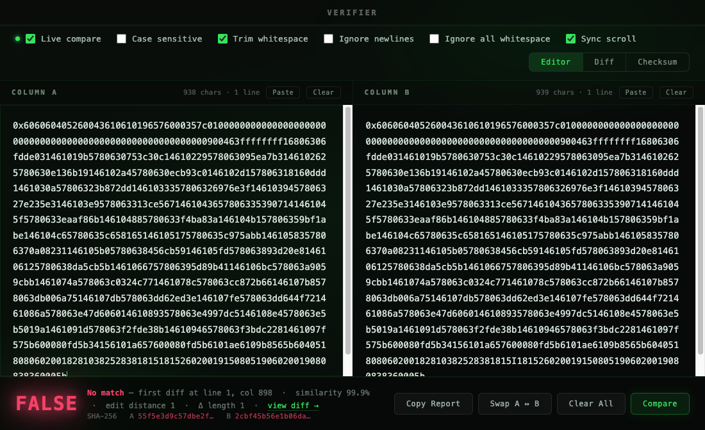
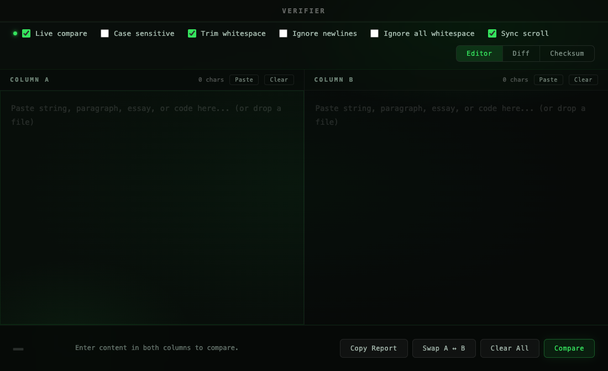

<div align="center">

<br>

# Verifier

### A lightweight, instant string comparison tool.
### Paste anything into Column A and Column B — get **TRUE** or **FALSE** in real time.

<br>

*Built for developers, security researchers, writers, and anyone who has ever squinted*
*at two lines of text wondering if they are actually identical.*

<br>



<br>

---

<br>

## What it's for

</div>

<br>

**Compare hashes at a glance — instantly.**
Verify transaction hashes, checksums, API keys, wallet addresses, or any token without squinting character by character. Paste both sides and the answer is immediate.

<br>

**Catch changes in code.**
Paste two versions of a function, config block, or environment variable side by side. Verifier tells you if they're identical — and if not, shows the exact edit distance so you know how far apart they are.

<br>

**Writers, bloggers, and editors.**
Paste your draft and your final version to confirm exactly what changed — or that nothing did. Checking a submitted essay matches a saved copy? Confirming a contract clause wasn't altered? TRUE means nothing changed. FALSE tells you exactly how much did.

<br>

<div align="center">



<br>

---

<br>

## Features

<br>

| | |
|:---|:---|
| **Live compare** | Updates TRUE / FALSE as you type |
| **Unlimited size** | Paste entire essays, codebases, or documents — no character limit |
| **Case sensitive** | Toggle on / off |
| **Trim whitespace** | Strips leading and trailing space before comparing |
| **Ignore newlines** | Flatten multi-line content for comparison |
| **Edit distance** | Levenshtein score shown on every mismatch |
| **Stats** | Char count, word count, line count, length diff |
| **Swap A ↔ B** | One click |
| **Copy Result** | Copies TRUE or FALSE to clipboard |

<br>



<br>

---

<br>

## Install

</div>

Download **Verifier.dmg**, open it, drag to Applications.

<br>

> **File size:** The DMG is ~95 MB and the installed app is **280 MB+**. This is expected — Electron bundles a complete Chromium engine and Node.js runtime so the app has zero external dependencies and runs fully offline.

<br>

> **macOS Gatekeeper:** Because the app isn't signed with an Apple Developer certificate, macOS will block it on first launch.
>
> To clear it:
> 1. In Finder, locate **Verifier.app** in your Applications folder
> 2. **Right-click → Open**
> 3. Click **Open** in the dialog that appears
>
> You only need to do this once. After that it launches normally.

<br>

---

<br>

## Run locally

```bash
npm install
npm start
```

<br>

## Build DMG

```bash
npm run build
```

Outputs `Verifier.dmg` directly to `~/Desktop`.

<br>

---

<div align="center">

<br>

*Pure Electron — no backend, no network, fully offline. Zero telemetry.*

<br>

</div>

---

## Contributing

Contributions are welcome. Feel free to open an issue or submit a pull request.

---

## Licence

Distributed under the MIT Licence. See `LICENCE` for more information.

---

## Disclaimer

This tool is for authorised UCL staff use only. Ensure you have appropriate permissions before automating Portico interactions. The authors are not responsible for any misuse or unintended consequences.

<br />
<br />

<div align="center">
  <a href="https://techangelx.com" target="_blank">
    
  </a>
  <br /><br />
  <span style="font-size: 1.4em; font-weight: 300;">
    Built by Ricki Angel • <a href="https://techangelx.com" target="_blank" style="text-decoration: none;">Tech Angel X</a>
  </span>
</div>
