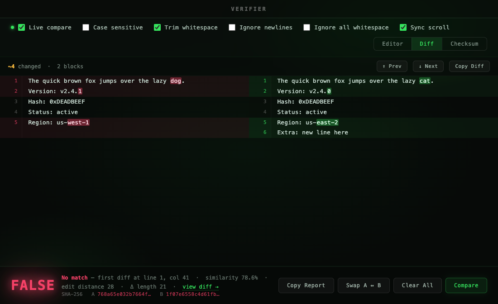
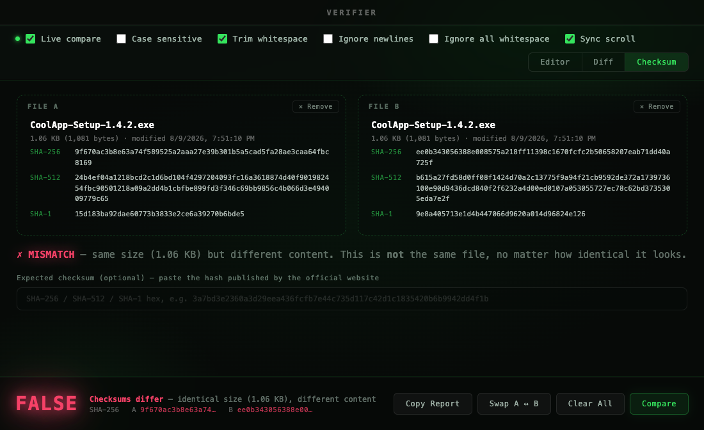

<div align="center">

# Verifier

### A lightweight, instant text string comparison tool.
### Paste anything into Column A and Column B — get **TRUE** or **FALSE** in real time.

*Built for essay writers, copy bloggers, code devs, and anyone who has ever squinted at two lines of text wondering if they are actually identical.*


### Can you tell the difference?

*Both columns contain 1,000+ characters of EVM bytecode. One character has been changed. Verifier catches it instantly.*


---

## What it's for

</div>

**Catch changes in any text.**
Paste two versions of anything — a paragraph, a config, a snippet of code, a form response — side by side. Verifier tells you if they're identical, and if not, shows exactly how far apart they are.

<br>

**Writers, bloggers, and editors.**
Paste your draft and your final version to confirm exactly what changed — or that nothing did. Checking a submitted piece matches a saved copy? Confirming a clause wasn't quietly altered? TRUE means nothing changed. FALSE tells you exactly how much did.

<br>

**Compare hashes at a glance — instantly.**
Verify transaction hashes, checksums, API keys, or any identifier without squinting character by character. Paste both sides and the answer is immediate.

<br>

**Verify downloads before you trust them.**
Grabbed an installer from a GitHub mirror that claims to be the same as the official one? Drop both files into the Checksum tab — or paste the hash the vendor publishes — and know for certain it's the genuine file, not just one that happens to be the same size.

<br>

<div align="center">

<br>

---

<br>

## Features

<br>

| | |
|:---|:---|
| **Live compare** | Updates TRUE / FALSE as you type |
| **Checksum panel** | Drop two files — an installer from the official site and the "same" one from a mirror — and verify they are byte-for-byte identical via SHA-256, SHA-512, and SHA-1. Same size ≠ same file; the hashes prove it |
| **Expected-hash check** | Paste the checksum published by a website and Verifier checks your downloaded file against it (auto-detects SHA-1 / SHA-256 / SHA-512) |
| **Side-by-side diff view** | Git-style line diff with changed, added, and removed lines highlighted |
| **Character-level highlights** | The exact characters that differ are marked inside each changed line |
| **Diff navigation** | Jump between difference blocks with Prev / Next; long unchanged runs collapse |
| **First-diff locator** | Shows the line and column of the first differing character |
| **Similarity score** | Percentage match + Levenshtein edit distance on every mismatch |
| **SHA-256 checksums** | Both columns hashed live — click a hash to copy it |
| **Unlimited size** | Paste entire essays, codebases, or documents — no character limit |
| **Case sensitive** | Toggle on / off |
| **Trim whitespace** | Strips leading and trailing space before comparing |
| **Ignore newlines** | Flatten multi-line content for comparison |
| **Ignore all whitespace** | Compare content only — spaces, tabs, and newlines dropped |
| **Sync scroll** | Both columns scroll together |
| **Drag & drop** | Drop any text file straight into a column |
| **Paste / Clear per column** | One-click clipboard paste and clear in each column header |
| **Copy Report** | Full comparison report with stats, hashes, and a unified diff |
| **Copy Diff** | Unified diff straight to the clipboard |
| **Keyboard shortcuts** | ⌘⏎ compare · ⌘D diff view · ⌘1/⌘2/⌘3 switch tabs · ⌘E swap · ⌘K clear |
| **Remembers your options** | Toggles persist between launches |
| **Swap A ↔ B** | One click |

<br>



<br>



<br>


<br>

---

<br>

## Install

</div>

Download **Verifier.dmg**, open it, drag to Applications.

<br>

> **File size:** The DMG is ~95 MB and the installed app is **280 MB+**. This is expected — Electron bundles a complete Chromium engine and Node.js runtime so the app has zero external dependencies and runs fully offline.

<br>

> **macOS Gatekeeper:** Because the app isn't signed with an Apple Developer certificate, macOS will block it on first launch.
>
> To clear it:
> 1. In Finder, locate **Verifier.app** in your Applications folder
> 2. **Right-click → Open**
> 3. Click **Open** in the dialog that appears
>
> You only need to do this once. After that it launches normally.

<br>

---

<br>

## Run locally

```bash
npm install
npm start
```

<br>

## Build DMG

```bash
npm run build
```

Outputs `Verifier.dmg` directly to `~/Desktop`.

<br>

---

<div align="center">

<br>

*Pure Electron — no backend, no network, fully offline. Zero telemetry. Plug 'n' Play.*

<br>

</div>

---

## Future Implementations

- **More hash functions** — MD5, SHA-512, and Keccak-256 digests alongside the built-in SHA-256
- **Encoding detection** — auto-detect and normalise Base64, hex, and UTF-8 encoded strings before comparing
- **Comparison history** — save and revisit previous comparisons within the session
- **Windows and Linux builds** — cross-platform DMG / EXE / AppImage releases

---

## Contributing

Contributions are welcome. Feel free to open an issue or submit a pull request.

---

## Licence

Distributed under the MIT Licence. See `LICENCE` for more information.

---

<div align="center">

## Disclaimer

</div>

This tool is provided as-is for general use. The authors are not responsible for any misuse or unintended consequences.

<br />
<br />

<div align="center">
  <a href="https://techangelx.com" target="_blank">
    
  </a>
  <br /><br />
  <span style="font-size: 1.4em; font-weight: 300;">
    Built by Ricki Angel • <a href="https://techangelx.com" target="_blank" style="text-decoration: none;">Tech Angel X</a>
  </span>
</div>
